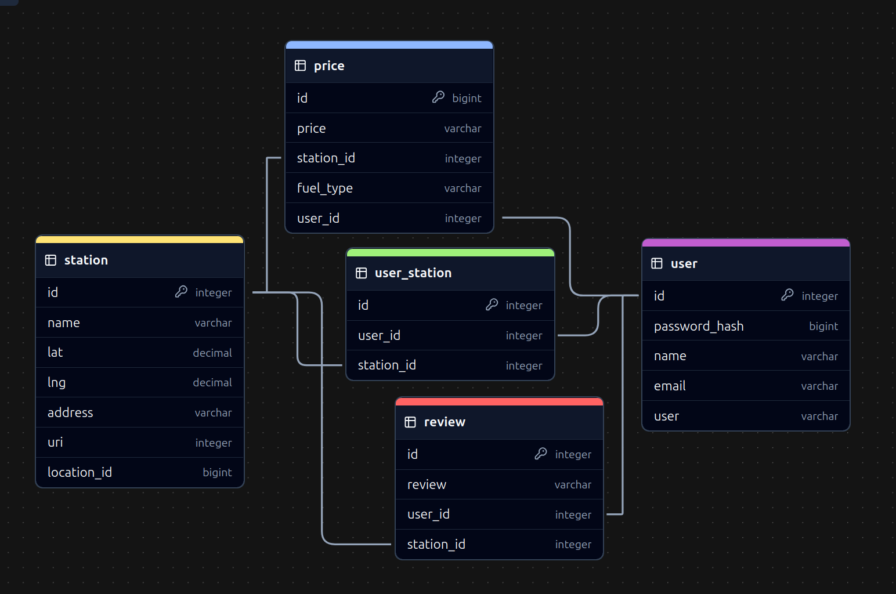

# api documentation



## general format of all response body values

```json
{
  "slice, aka table": {
    "id": {
      "key": "values",
      "for": "object, aka record"
    }
  }
}
```

## king authentication/authorization

### all endpoints that require authentication

all endpoints that require a current king to be logged in.

- request: endpoints that require authentication
- error response:

  ```http
  http/1.1 401 unauthorized
  content-type: application/json

  {
        "message": "authentication required"
  }
  ```

### all endpoints that require proper authorization

all endpoints that require authentication and the current king does
not have the correct role(s) or permission(s).

- response:

  ```http
  http/1.1 403 forbidden
  content-type: application/json

  {"message":"forbidden"}
  ```

## endpoints

### king

#### get the current king

returns the information about the current king that is logged in.

- require authentication: false
- request

  ```http
  get /api/king/current
  ```

- successful response when there is a logged in king

  ```http
  http/1.1 200 ok
  content-type: application/json

  {
    "king":
    {
      "1":
      {
        "id": 1,
        "name": "john smith",
        "email": "john.smith@example.com",
        "nick": "johnsmith"
      }
    }
  }
  ```

- successful response when there is no logged in king

  ```http
  http/1.1 200 ok
  content-type: application/json

  {
    "king": null
  }
  ```

#### log in a king

logs in a current king with valid credentials and returns the current
king's information.

- require authentication: false
- request

  ```http
  post /api/session
  content-type: application/json

  {
    "credential": "john.smith@gmail.com",
    "password": "secret password"
  }
  ```

- successful response

  ```http
  http/1.1 200 ok
  content-type: application/json

  {
    "king":
    {
      "1":
      {
        "id": 1,
        "name": "john smith",
        "email": "john.smith@example.com",
        "nick": "johnsmith"
      }
    }
  }
  ```

- error response: invalid credentials

  ```http
  http/1.1 401 unauthorized
  content-type: application/json

  {
    "message": "invalid credentials"
  }
  ```

- error response: body validation errors

  ```http
  http/1.1 400 bad request
  content-type: application/json

  {
    "message": "bad request",
    "errors":
    {
      "credential": "email or nickname is required",
      "password": "password is required"
    }
  }
  ```

#### sign up a king

creates a new king, logs them in as the current king, and returns the
current king's information.

- require authentication: false
- request

  ```http
  post /api/king
  content-type: application/json

  {
    "name": "john smith",
    "email": "john.smith@example.com",
    "nick": "johnsmith",
    "password": "secret password"
  }
  ```

- successful response

  ```http
  http/1.1 201 created
  content-type: application/json

  {
    "king":
    {
      "1":
      {
        "id": 1,
        "name": "john smith",
        "email": "john.smith@example.com",
        "nick": "johnsmith"
      }
    }
  }
  ```

- error response: king already exists with the specified email or
  nickname

  ```http
  http/1.1 500 internal server error
  content-type: application/json

  {
    "message": "king already exists",
    "errors": {
      "email": "king with that email already exists",
      "nick": "account with that nickname already exists"
    }
  }
  ```

#### update a king

update an extant king, and returns the current king's information.

- require authentication: true
- request

  ```http
  put /api/king/1
  content-type: application/json

  {
    "name": "john smith",
    "email": "john.smith2@example.com",
    "nick": "johnsmith2",
    "password": "secret password2"
  }
  ```

- successful response

  ```http
  http/1.1 200 ok
  content-type: application/json

  {
    "king":
    {
      "1":
      {
        "id": 1,
        "name": "john smith",
        "email": "john.smith2@example.com",
        "nick": "johnsmith2"
      }
    }
  }
  ```

- error response: king already exists with the specified email or
  nickname

  ```http
  http/1.1 500 internal server error
  content-type: application/json

  {
    "message": "king already exists",
    "errors": {
      "email": "king with that email already exists",
      "nick": "account with that nickname already exists"
    }
  }
  ```

- error response: body validation errors

  ```http
  http/1.1 400 bad request
  content-type: application/json

  {
    "message": "bad request",
    "errors": {
      "email": "invalid email",
      "nick": "nickname is required",
      "name": "name is required",
    }
  }
  ```

#### delete a king

- require authentication: true
- request
  ```http
  delete /api/king/
  ```
- success:

  ```http
  http/1.1 200 ok

  {
    "message": "deleted king 1 successfully"
  }
  ```

#### get all stations for the current king

returns all the stations owned (created) by the current king.

- require authentication: true
- request

  ```http
  get /api/king/current/station
  ```

- example successful response

  ```http
  http/1.1 200 ok
  content-type: application/json

  {
    "station":
    {
      "1":
      {
        "id": 1,
        "name": "arco",
        "lat": 37.7645358,
        "lng": -122.4730327,
        "address": "123 fake street, beverly hills, 90210, ca, usa",
        "uri": "some google maps uri thing, idk",
        "location_id": "some google maps location id, idk",
        "created": "2021-11-19 20:39:36",
        "updated": "2021-11-19 20:39:36"
      },
      "12":
      {
        "id": 12,
        "name": "bp",
        "lat": 9.4,
        "lng": -86.75,
        "address": "456 real street, beverly mountains, 90211, ca, usa",
        "uri": "some google maps uri thing, idk",
        "location_id": "some google maps location id, idk",
        "created": "2021-11-19 20:39:36",
        "updated": "2021-11-19 20:39:36"
      }
    }
  }
  ```

#### get all reviews for current king

returns all the reviews owned (created) by the current king.

- require authentication: true
- request

  ```http
  get /api/king/current/review
  ```

- example successful response

  ```http
  http/1.1 200 ok
  content-type: application/json

  {
    "review":
    {
      "1":
      {
        "id": 1,
        "review": "wow, what a great station"
        "station_id": 2,
        "king_id": 1,
        "created": "2021-11-19 20:39:36",
        "updated": "2023-11-19 20:39:36"
      },
      "12":
      {
        "id": 12,
        "review": "wow, what a great station"
        "station_id": 2,
        "king_id": 1,
        "created": "2021-11-19 20:39:36",
        "updated": "2023-11-19 20:39:36"
      },
    }
  }
  ```

#### get all prices for current king

returns all prices for the current king

- requires authentication: true

- request

  ```http
  get /api/king/1/price
  ```

- success

  ```http
  http/1.1 ok
  content-type: application/json

  {
    "price":
    {
      "1":
      {
        "id": 1,
        "price": 456.789,
        "station_id": 1,
        "king_id": 1,
        "fuel_type": "one of: electric, unleaded, leaded, or premium",
        "created": "2021-11-19 20:39:36",
        "updated": "2021-11-19 20:39:36"
      },
      "12":
      {
        "id": 12,
        "price": 132.45
        "station_id": 1,
        "king_id": 1,
        "fuel_type": "one of: electric, unleaded, leaded, or premium",
        "created": "2021-11-19 20:39:36",
        "updated": "2021-11-19 20:39:36"
      }
    }
  }
  ```

### station

#### get all stations

- require authentication: false

- request

  ```http
  get /api/station
  ```

- successful response

  ```http
  http/1.1 200 ok
  content-type: application/json

  {
    "station":
    {
      "1":
      {
        "id": 1,
        "name": "arco",
        "lat": 37.7645358,
        "lng": -122.4730327,
        "address": "123 fake street, beverly hills, 90210, ca, usa",
        "uri": "some google maps uri thing, idk",
        "location_id": "some google maps location id, idk",
        "created": "2021-11-19 20:39:36",
        "updated": "2021-11-19 20:39:36"
      }
      "12":
      {
        "id": 12,
        "name": "bp",
        "lat": 9.4,
        "lng": -86.75,
        "address": "456 real street, beverly mountains, 90211, ca, usa",
        "uri": "some google maps uri thing, idk",
        "location_id": "some google maps location id, idk",
        "created": "2021-11-19 20:39:36",
        "updated": "2021-11-19 20:39:36"
      }
    }
  }
  ```

#### get details of a station from an id

returns the details of a spot specified by its id.

- require authentication: false

- request

  ```http
  get /api/station/:station_id
  ```

- successful response

  ```http
  http/1.1 200 ok
  content-type: application/json

  {
    "station":
    {
      "1":
      {
        "id": 1,
        "name": "arco",
        "lat": 37.7645358,
        "lng": -122.4730327,
        "address": "123 fake street, beverly hills, 90210, ca, usa",
        "uri": "some google maps uri thing, idk",
        "location_id": "some google maps location id, idk",
        "created": "2021-11-19 20:39:36",
        "updated": "2021-11-19 20:39:36"
      }
    }
  }

  ```

- error response: couldn't find a station with the specified id

  ```http
  http/1.1 404

  {
    "message": "station 1 couldn't be found"
  }
  ```

#### save a station by creating a station record

- require authentication: true

- request

  ```http
  post /api/station
  content-type: application/json

  {
    "name": "arco",
    "lat": 37.7645358,
    "lng": -122.4730327,
    "address": "123 fake street, beverly hills, 90210, ca, usa",
    "uri": "some google maps uri thing, idk",
    "location_id": "some google maps location id, idk"
  }
  ```

- success response

  ```http
  http/1.1 201 created
  content-type: application/json

  {
    "station":
    {
      "1":
      {
        "id": 1,
        "name": "arco",
        "lat": 37.7645358,
        "lng": -122.4730327,
        "address": "123 updated street, beverly hills, 90210, ca, usa",
        "uri": "some google maps uri thing, idk",
        "location_id": "some google maps location id, idk",
        "created": "2021-11-19 20:39:36",
        "updated": "2021-11-19 20:39:36"
      }
    }
  }
  ```

- error response: body validation errors

  ```http
  http/1.1 400 bad request
  content-type: application/json

  {
    "message": "bad request",
    "errors": {
      "lat": "-90 <= lat <= 90",
      "lng": "-180 <= lng <= 180",
      "address": "address is required",
      "uri": "uri is required",
      "location_id": "location_id is required"
    }
  }
  ```

#### update a station

- require authentication: true

- request

  ```http
  put /api/station/1
  content-type: application/json

  {
    "name": "new arco",
    "lat": 37.7645358,
    "lng": -122.4730327,
    "address": "123 updated street, beverly hills, 90210, ca, usa",
    "uri": "some google maps uri thing, idk",
    "location_id": "some google maps location id, idk"
  }
  ```

- success response

  ```http
  http/1.1 201 created
  content-type: application/json

  {
    "station":
    {
      "1":
      {
        "id": 1,
        "name": "new arco",
        "lat": 37.7645358,
        "lng": -122.4730327,
        "address": "123 updated street, beverly hills, 90210, ca, usa",
        "uri": "some google maps uri thing, idk",
        "location_id": "some google maps location id, idk",
        "created": "2021-11-19 20:39:36",
        "updated": "2021-11-19 20:39:36"
      }
    }
  }
  ```

- error response: body validation errors

  ```http
  http/1.1 400 bad request
  content-type: application/json

  {
    "message": "bad request",
    "errors": {
      "lat": "-90 <= lat <= 90",
      "lng": "-180 <= lng <= 180",
      "address": "address is required",
      "uri": "uri is required",
      "location_id": "location_id is required"
    }
  }
  ```

#### delete a station

- require authentication: true

- request

  ```http
  delete /api/station/1
  ```

- success:

  ```http
  http/1.1 200 ok
  content-type: application/json

  {
    "message": "deleted station 1 successfully"
  }
  ```

- failure:

  ```http
  http/1.1 404
  content-type: application/json

  {
    "error": "station 1 not found"
  }
  ```

#### get all reviews for station

returns all the reviews owned (created) by the station.

- require authentication: true
- request

  ```http
  get /api/station/1/review
  ```

- example successful response

  ```http
  http/1.1 200 ok
  content-type: application/json

  {
    "review":
    {
      "1":
      {
        "id": 1,
        "review": "wow, what a great station"
        "station_id": 1,
        "king_id": 1,
        "created": "2021-11-19 20:39:36",
        "updated": "2023-11-19 20:39:36"
      },
      "12":
      {
        "id": 12,
        "review": "wow, what a great station"
        "station_id": 1,
        "king_id": 1,
        "created": "2021-11-19 20:39:36",
        "updated": "2023-11-19 20:39:36"
      },
    }
  }
  ```

#### get all prices for station

returns all prices for the station

- requires authentication: true

- request

  ```http
  get /api/station/1/price
  ```

- success

  ```http
  http/1.1 ok
  content-type: application/json

  {
    "price":
    {
      "1":
      {
        "id": 1,
        "price": 456.789,
        "king_id": 1,
        "station_id": 1,
        "fuel_type": "one of: electric, unleaded, leaded, or premium",
        "created": "2021-11-19 20:39:36",
        "updated": "2021-11-19 20:39:36"
      },
      "12":
      {
        "id": 12,
        "price": 132.45
        "king_id": 1,
        "station_id": 1,
        "fuel_type": "one of: electric, unleaded, leaded, or premium",
        "created": "2021-11-19 20:39:36",
        "updated": "2021-11-19 20:39:36"
      }
    }
  }
  ```

### price

#### create

- require authentication: true

- request

  ```http
  post /api/price
  content-type: application/json

  {
    "price": 456.789,
    "king_id": 1,
    "station_id": 1,
    "fuel_type": "one of: electric, unleaded, leaded, or premium"
  }
  ```

- success:

  ```http
  http/1.1 200 ok
  content-type: application/json

  {
    "price":
    {
      "1":
      {
        "id": 1,
        "price": 456.789,
        "king_id": 1,
        "station_id": 1,
        "fuel_type": "one of: electric, unleaded, leaded, or premium",
        "created": "2021-11-19 20:39:36",
        "updated": "2021-11-19 20:39:36"
      }
    }
  }
  ```

- failure:

  ```http
  http/1.1 400 bad request
  {
    "message": "bad request",
    "errors":
    {
      "price": "price is required",
      "king_id": "king id is required",
      "station_id": "station id is required",
      "fuel_type": "fuel type is required"
    }
  }
  ```

#### read

- require authentication: false

- request:

  ```
  get /api/price/1
  ```

- success:

  ```http
  http/1.1 200 ok
  content-type: application/json

  {
    "price":
    {
      "1":
      {
        "id": 1,
        "price": 456.789,
        "king_id": 1,
        "station_id": 1,
        "fuel_type": "one of: electric, unleaded, leaded, or premium",
        "created": "2021-11-19 20:39:36",
        "updated": "2021-11-19 20:39:36"
      }
    }
  }
  ```

- failure:

  ```http
  http/1.1 404

  {
    "error": "price 1 not found"
  }
  ```

#### read all

- require authentication: false

- request:

  ```
  get /api/price
  ```

- success:

  ```http
  http/1.1 200 ok
  content-type: application/json

  {
    "price":
    {
      "1":
      {
        "id": 1,
        "price": 456.789,
        "king_id": 1,
        "station_id": 1,
        "fuel_type": "one of: electric, unleaded, leaded, or premium",
        "created": "2021-11-19 20:39:36",
        "updated": "2021-11-19 20:39:36"
      }
      "2":
      {
        "id": 2,
        "price": 123.456,
        "king_id": 1,
        "station_id": 1,
        "fuel_type": "one of: electric, unleaded, leaded, or premium",
        "created": "2022-11-19 20:39:36",
        "updated": "2022-11-19 20:39:36"
      }
    }
  }
  ```

#### update

- require authentication: true

- request

  ```http
  post /api/price/1
  content-type: application/json

  {
    "price": 666.49,
    "station_id": 2,
    "fuel_type": "one of: electric, unleaded, leaded, or premium"
  }
  ```

- success:

  ```http
  http/1.1 200 ok
  content-type: application/json

  {
    "price":
    {
      "1":
      {
        "id": 1,
        "price": 666.49
        "king_id": 1,
        "station_id": 2,
        "fuel_type": "one of: electric, unleaded, leaded, or premium",
        "created": "2021-11-19 20:39:36",
        "updated": "2023-11-19 20:39:36"
      }
    }
  }
  ```

- failure:

  ```http
  http/1.1 400 bad request
  {
    "message": "bad request",
    "errors":
    {
      "price": "price is required",
      "king_id": "king id is required",
      "station_id": "station id is required",
      "fuel_type": "fuel type is required"
    }
  }
  ```

#### delete

- require authentication: true

- request

  ```http
  delete /api/price/1
  ```

- success:

  ```http
  http/1.1 200 ok

  {
    "message": "deleted price 1 successfully"
  }
  ```

- failure:

  ```http
  http/1.1 404

  {
    "error": "price 1 not found"
  }
  ```

### review

#### create

- require authentication: true

- request

  ```http
  post /api/review
  content-type: application/json

  {
    "review": "very nice gas station",
    "station_id": 1
  }
  ```

- success:

  ```http
  http/1.1 200 ok
  content-type: application/json

  {
    "review":
    {
      "1":
      {
        "id": 1,
        "review": 456.789,
        "station_id": 1,
        "king_id": 1,
        "created": "2021-11-19 20:39:36",
        "updated": "2021-11-19 20:39:36"
      }
    }
  }
  ```

- failure:

  ```http
  http/1.1 400 bad request
  {
    "message": "bad request",
    "errors":
    {
      "review": "review is required",
      "station_id": "station id is required"
    }
  }
  ```

#### read

- require authentication: false

- request:

  ```
  get /api/review/1
  ```

- success:

  ```http
  http/1.1 200 ok
  content-type: application/json

  {
    "review":
    {
      "1":
      {
        "id": 1,
        "review": 456.789,
        "station_id": 1,
        "king_id": 1,
        "created": "2021-11-19 20:39:36",
        "updated": "2021-11-19 20:39:36"
      }
    }
  }
  ```

- failure:

  ```http
  http/1.1 404

  {
    "error": "review 1 not found"
  }
  ```

#### read all

- require authentication: false

- request:

  ```
  get /api/review
  ```

- success:

  ```http
  http/1.1 200 ok
  content-type: application/json

  {
    "review":
    {
      "1":
      {
        "id": 1,
        "review": 456.789,
        "station_id": 1,
        "king_id": 1,
        "created": "2021-11-19 20:39:36",
        "updated": "2021-11-19 20:39:36"
      }
      "2":
      {
        "id": 2,
        "review": 123.456,
        "station_id": 1,
        "king_id": 1,
        "created": "2022-11-19 20:39:36",
        "updated": "2022-11-19 20:39:36"
      }
    }
  }
  ```

#### update

- require authentication: true

- request

  ```http
  post /api/review/1
  content-type: application/json

  {
    "review": 666.49,
    "station_id": 2,
    "king_id": 1
  }
  ```

- success:

  ```http
  http/1.1 200 ok
  content-type: application/json

  {
    "review":
    {
      "1":
      {
        "id": 1,
        "review": "wow, what a great station"
        "station_id": 2,
        "king_id": 1,
        "created": "2021-11-19 20:39:36",
        "updated": "2023-11-19 20:39:36"
      }
    }
  }
  ```

- failure:

  ```http
  http/1.1 400 bad request
  {
    "message": "bad request",
    "errors":
    {
      "review": "review is required",
      "station_id": "station id is required",
      "king_id": 1
    }
  }
  ```

#### delete

- require authentication: true

- request

  ```http
  delete /api/review/1
  ```

- success:

  ```http
  http/1.1 200 ok

  {
    "message": "deleted review 1 successfully"
  }
  ```

- failure:

  ```http
  http/1.1 404

  {
    "error": "review 1 not found"
  }
  ```
